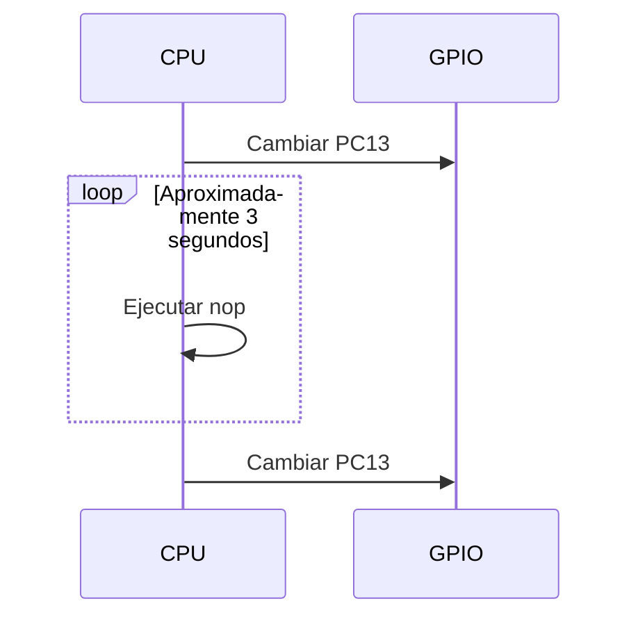

# 3. Conceptos y preguntas

## Espera activa

La función de retardo ejecuta repetidamente instrucciones `nop`. La CPU no
realiza un trabajo útil durante ese intervalo:

## Limitaciones

- El retardo es aproximado.
- Cambia si se modifica el reloj.
- Puede cambiar con la optimización del compilador.
- La CPU no puede atender de manera organizada varias tareas concurrentes.
- No proporciona una base adecuada para protocolos o interfaces reactivas.

Estas limitaciones justifican el ejercicio posterior con SysTimer,
interrupciones y una máquina de estados.

## Actividades

1. Identifique en `main.c` dónde se configura PC13.
2. Cambie `BLINK_INTERVAL_MS` de 3000 a 1000.
3. Mida el periodo real con osciloscopio o analizador lógico.
4. Compare el tiempo solicitado con el tiempo medido.
5. Abra `GD32VW55x.lst` e identifique una instrucción `nop`.
6. Explique por qué el archivo `.elf` se utiliza para depuración y el `.bin`
   puede utilizarse para programación.

## Preguntas de análisis

1. ¿Cuánto dura un ciclo completo si el pin cambia cada tres segundos?
2. ¿Qué ocurre con el retardo si aumenta la frecuencia del procesador?
3. ¿Puede la CPU procesar comandos UART mientras permanece en la espera?
4. ¿Cuál es la diferencia entre nivel lógico del GPIO y estado visible del LED?
5. ¿Qué mecanismo permitirá eliminar esta espera bloqueante?

## Evidencia mínima

- Captura de la compilación exitosa.
- Salida de `riscv-nuclei-elf-size`.
- Fotografía o video breve del LED.
- Medición del periodo.
- Fragmento identificado del archivo `.lst`.
- Respuestas justificadas a las preguntas.

