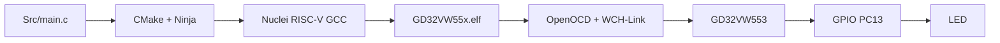
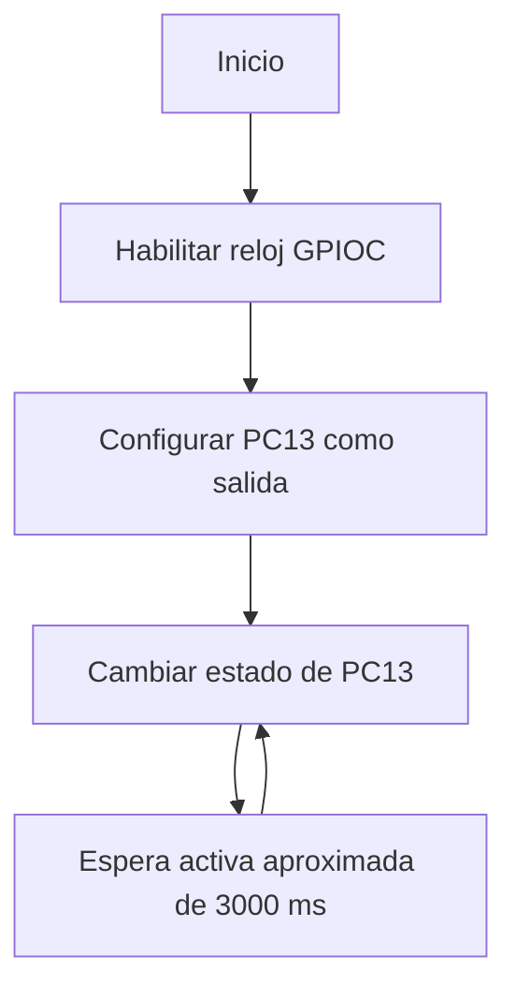

# Exercise 00 - Blink con espera activa en GD32VW553

**Curso:** Estructuras Computacionales (4100901)  
**Plataforma:** GD32VW553HMQ6 / GD32VW553HMQ7  
**Arquitectura:** Nuclei RISC-V RV32  
**Entorno:** Visual Studio Code, CMake, Ninja y Nuclei RISC-V GCC

## 1. Propósito

Este ejercicio verifica la cadena completa de desarrollo antes de comenzar las
prácticas obligatorias de las semanas 5 a 8:

1. editar código fuente;
2. configurar el proyecto con CMake;
3. compilar para RISC-V;
4. generar archivos ELF, HEX, BIN, MAP y LST;
5. programar la memoria flash con OpenOCD;
6. observar el cambio de estado del LED conectado a PC13.

El retardo de este ejercicio se produce mediante **espera activa**. El
procesador permanece ejecutando instrucciones `nop` durante la espera. No se
utiliza todavía SysTimer, interrupciones ni una máquina de estados.

## 2. Resultado esperado

El programa cambia el estado lógico de PC13 aproximadamente cada tres segundos.
Por tanto, cada estado dura cerca de 3 s y un ciclo completo encendido-apagado
dura aproximadamente 6 s.

> El LED de algunas placas puede ser activo en nivel bajo. En ese caso, el
> significado eléctrico de encendido y apagado se invierte, pero el periodo de
> conmutación permanece igual.

## 3. Diagrama de bloques



## 4. Flujo del programa



## 5. Estructura del repositorio

```text
4100901-gd32vw553-blink-polling/
├── .vscode/
│   └── tasks.json
├── Doc/
│   ├── 1_SETUP.md
│   ├── 2_BUILD_AND_FLASH.md
│   └── 3_CONCEPTS_AND_QUESTIONS.md
├── Inc/
│   └── gd32vw55x_libopt.h
├── Src/
│   └── main.c
├── cmake/
│   ├── generate_listing.cmake
│   └── toolchain-riscv.cmake
├── tools/
│   ├── configure.ps1
│   ├── flash.ps1
│   └── local_config.example.ps1
├── .gitignore
├── CMakeLists.txt
├── CMakePresets.json
└── README.md
```

## 6. Preparación rápida

1. Instale CMake, Ninja y GD32 Embedded Builder.
2. Copie:

   ```text
   tools/local_config.example.ps1
   ```

   como:

   ```text
   tools/local_config.ps1
   ```

3. Edite las tres rutas del archivo local.
4. Abra esta carpeta como raíz del espacio de trabajo en VS Code.
5. Ejecute la tarea `Build + Flash GD32`.

Las instrucciones detalladas están en [Doc/1_SETUP.md](Doc/1_SETUP.md) y
[Doc/2_BUILD_AND_FLASH.md](Doc/2_BUILD_AND_FLASH.md).

## 7. Relación con el curso

Este ejercicio es la línea base para comparar dos formas de temporización:

| Ejercicio | Temporización | CPU durante la espera |
|---|---|---|
| Blink Polling | ciclos y `nop` | ocupada |
| Semana 6 | SysTimer + interrupción | disponible para otras tareas |

La siguiente evolución reemplazará el retardo bloqueante por SysTimer y una
máquina de estados no bloqueante.

## 8. Dependencia externa

El repositorio utiliza la biblioteca oficial
`GD32VW55x_Firmware_Library_V1.6.0`, pero no copia sus drivers. Cada usuario
indica su ubicación mediante `tools/local_config.ps1`. Esto evita guardar rutas
personales en GitHub y mantiene separados el ejercicio y el SDK del fabricante.

